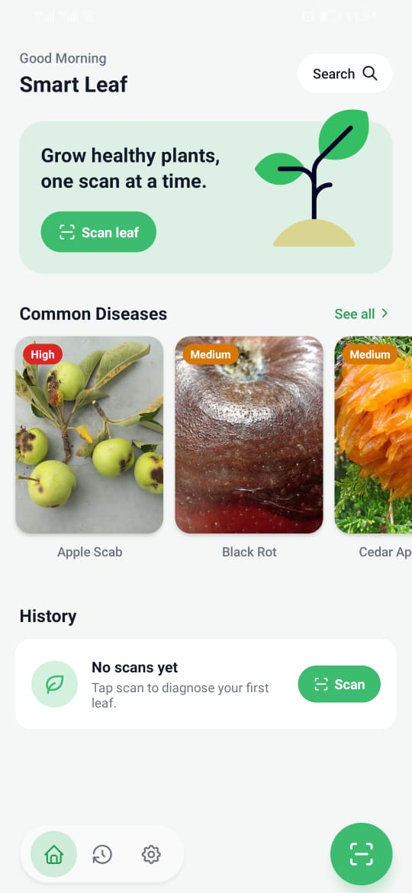
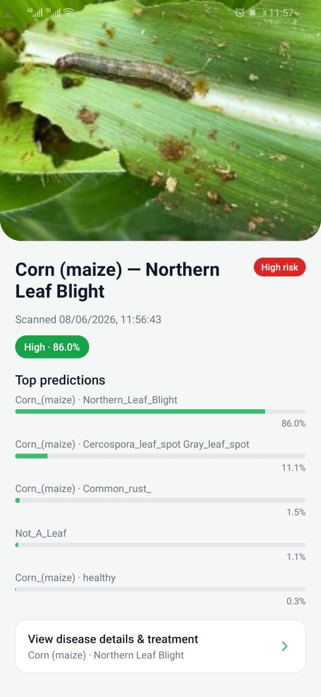

# 🌿 Smart Leaf

**On-device plant disease identification.** Point your camera at a leaf and Smart Leaf tells you what's wrong with it — fully offline, no server, no internet required. A quantized TensorFlow Lite model runs the inference directly on the phone.

<p align="left">
  <a href="https://play.google.com/store/apps/details?id=com.yasinwalum.smartleaf">
    
  </a>
  
  
  
</p>

---

## Table of contents

- [What it does](#what-it-does)
- [Screenshots](#screenshots)
- [How it works](#how-it-works)
- [The model & dataset](#the-model--dataset)
- [Tech stack](#tech-stack)
- [Project structure](#project-structure)
- [Getting started](#getting-started)
- [Building an APK](#building-an-apk)
  - [Preview APK (cloud)](#1-preview-apk--cloud-eas)
  - [Production AAB / APK (cloud)](#2-production-build--cloud-eas)
  - [Local APK (no EAS servers)](#3-local-apk--on-your-machine)
- [Permissions](#permissions)
- [License](#license)

---

## What it does

- 📷 **Scan a leaf** with the in-app camera (with pinch/zoom via a native module) or pick a photo from the gallery.
- 🧠 **Identify the disease** across **38 crop-disease classes** spanning Apple, Blueberry, Cherry, Corn, Grape, Orange, Peach, Pepper, Potato, Raspberry, Soybean, Squash, Strawberry, and Tomato.
- 🚫 **Knows when it's not a leaf.** A dedicated `Not_A_Leaf` reject class plus a confidence/entropy gate means the app says *"that's not a leaf"* instead of hallucinating a disease on a random photo.
- 📚 **Disease library** with treatment and prevention guidance for each condition.
- 🕓 **Scan history** stored locally on the device.
- 🔌 **100% offline.** Inference, storage, and the disease guide all live on the phone. Nothing is uploaded.

## Screenshots

<p align="center">
  
  
</p>

| Screen | File |
|---|---|
| Home | `docs/screenshots/home.jpeg` |
| Scan result | `docs/screenshots/details.jpeg` |

## How it works

```
 Camera / Gallery
        │
        ▼
 Image → resized to 224×224 RGB (expo-image-manipulator + jpeg-js)
        │
        ▼
 react-native-fast-tflite  ──►  smartleaf_fp16.tflite  (EfficientNetB0, Float16)
        │
        ▼
 Softmax → temperature calibration → confidence + entropy gate
        │
        ▼
 Verdict  (disease name + confidence, or "Not a leaf")
```

The on-device pipeline is a faithful port of the training notebook's inference path. The same preprocessing, temperature scaling, and rejection logic run in both places, so phone predictions match the notebook's:

- **Preprocessing** — `src/ml/preprocess.ts`
- **Inference, calibration & decision gate** — `src/ml/inference.ts`
- **Model loading/provider** — `src/ml/SmartLeafModelProvider.tsx`
- **Inference config** (`img_size`, `temperature`, `conf_threshold`, `entropy_frac`) — `assets/models/infer_config.json`

## The model & dataset

| | |
|---|---|
| **Architecture** | EfficientNetB0 (ImageNet-pretrained backbone, fine-tuned) |
| **Input** | 224×224 RGB, raw `[0,255]` (EfficientNet preprocessing baked into the graph) |
| **Output** | 39 classes — 38 PlantVillage disease/healthy classes + 1 `Not_A_Leaf` reject class |
| **Format** | Float16 TensorFlow Lite (`smartleaf_fp16.tflite`) |
| **Calibration** | Temperature scaling + confidence/entropy thresholds for out-of-distribution rejection |
| **Training target** | > 95% validation accuracy |

### Where things live

| Artifact | Path |
|---|---|
| 📓 **Training notebook** | [`assets/models/train_smartleaf.ipynb`](assets/models/train_smartleaf.ipynb) |
| 🤖 Deployed TFLite model | `assets/models/smartleaf_fp16.tflite` |
| 🏷️ Class index → label map | `assets/models/class_names.json` |
| ⚙️ Inference config | `assets/models/infer_config.json` |

### Datasets used

The model was trained on Kaggle. The notebook auto-discovers these inputs:

| Dataset | Role | Source |
|---|---|---|
| **New Plant Diseases Dataset** (augmented PlantVillage) | 38 leaf disease/healthy classes | [Kaggle](https://www.kaggle.com/datasets/vipoooool/new-plant-diseases-dataset) |
| **Intel Image Classification** | Negatives for the `Not_A_Leaf` class | [Kaggle](https://www.kaggle.com/datasets/puneet6060/intel-image-classification) |
| **Caltech 256** | Negatives for the `Not_A_Leaf` class | [Kaggle](https://www.kaggle.com/datasets/jessicali9530/caltech256) |

> The notebook keeps the 38 plant-class indices locked to PlantVillage's sorted order and merges the non-leaf datasets in as a separate index (38), so adding negatives never re-sorts the disease labels. Plant-like categories (forest, fern, flower, etc.) are filtered out of the negatives.

### Reproducing the model

1. Open `assets/models/train_smartleaf.ipynb` on Kaggle (it expects the `/kaggle/input` and `/kaggle/working` layout and a GPU runtime).
2. Add the three datasets above as Kaggle Inputs.
3. Run all cells. The notebook does: setup & reproducibility → data loading & class locking → augmentation pipeline → EfficientNetB0 build → two-phase training (head, then fine-tune) → evaluation → temperature calibration → export to `.keras` and Float16 `.tflite`.
4. Copy the exported `smartleaf_fp16.tflite` and `infer_config.json` into `assets/models/`.

## Tech stack

- **[Expo SDK 56](https://docs.expo.dev/versions/v56.0.0/)** + **React Native 0.85** (New Architecture)
- **TypeScript**, **expo-router** (file-based, typed routes)
- **[react-native-fast-tflite](https://github.com/mrousavy/react-native-fast-tflite)** (Nitro Modules) for on-device inference
- **Zustand** for state, **expo-sqlite** + AsyncStorage for local persistence
- **expo-camera**, **expo-image-picker**, **expo-image-manipulator** for capture & preprocessing
- A custom native **camera-zoom** Expo module (`modules/camera-zoom`, Swift + Kotlin)
- **pnpm** for package management

## Project structure

```
src/
├── app/                 # expo-router screens (file-based routing)
│   └── (main)/          # tab groups: scan, history, library, settings
├── components/          # UI components grouped by feature
├── ml/                  # on-device inference: preprocess, calibrate, decide, model provider
├── data/                # disease guide content & hero images
├── stores/              # Zustand stores (scan, history, settings)
├── storage/             # local image persistence
└── constants/           # navigation, fonts, diagnosis config
assets/
├── models/              # TFLite model, class map, infer config, training notebook
└── images/              # icons, splash, disease reference images
modules/
└── camera-zoom/         # custom native Expo module (iOS Swift + Android Kotlin)
docs/                    # marketing/support website (privacy policy, get-app, about)
```

## Getting started

> **Note:** Smart Leaf uses native modules (TFLite, custom camera-zoom), so it **cannot run in Expo Go**. You need a development build.

### Prerequisites

- Node.js 18+
- [pnpm](https://pnpm.io/)
- For Android: Android Studio + SDK; for iOS: Xcode (macOS)
- An [Expo account](https://expo.dev/) and the EAS CLI for cloud builds:
  ```bash
  npm install -g eas-cli
  eas login
  ```

### Install & run

```bash
# 1. Install dependencies
pnpm install

# 2. Build & run a development client on a connected device/emulator
npx expo run:android      # or: npx expo run:ios

# 3. After the dev client is installed, start the bundler for fast reloads
pnpm start
```

| Script | Action |
|---|---|
| `pnpm start` | Start the Metro bundler / dev client |
| `pnpm android` | Start and open on Android |
| `pnpm ios` | Start and open on iOS |
| `pnpm web` | Start the web build |
| `pnpm lint` | Run ESLint |

## Building an APK

Builds are configured in [`eas.json`](eas.json). There are three profiles: **development**, **preview**, and **production**.

### 1. Preview APK — cloud (EAS)

A shareable internal APK, ideal for testers. Built on Expo's servers.

```bash
eas build --profile preview --platform android
```

When it finishes, EAS prints a download URL for the `.apk`. Install it directly on any Android device (enable "install from unknown sources").

### 2. Production build — cloud (EAS)

The release build for the Play Store. With `appVersionSource: "remote"` and `autoIncrement`, EAS manages the version code for you. By default this produces an **AAB** (the Play Store format):

```bash
eas build --profile production --platform android
```

Want a production-signed **APK** instead of an AAB (e.g. for direct distribution)? Add an APK build type to the production profile in `eas.json`:

```jsonc
"production": {
  "autoIncrement": true,
  "android": { "buildType": "apk" }
}
```

Submit a production build straight to Google Play:

```bash
eas submit --profile production --platform android
```

### 3. Local APK — on your machine

Build without using Expo's cloud servers (requires a local Android SDK / JDK setup):

```bash
# Build the chosen profile locally — outputs an .apk/.aab in the project root
eas build --profile preview --platform android --local
```

Or build entirely with the native Gradle toolchain (no EAS at all):

```bash
# Generate the native android/ project, then build a release APK
npx expo prebuild --platform android
cd android
./gradlew assembleRelease
# → android/app/build/outputs/apk/release/app-release.apk
```

> For a signed release you'll need to configure a keystore in `android/app` and reference it in `android/gradle.properties`. EAS-managed builds handle signing automatically.

## Permissions

| Permission | Why |
|---|---|
| **Camera** | Capture leaf photos to scan for disease |
| **Photos / media** | Pick an existing leaf image from the gallery |

No data leaves the device — all inference and storage are local. See the in-repo [privacy policy](docs/privacy-policy/) and the [project website](docs/) for details.

## License

[MIT](LICENSE) © Yasin Walum
